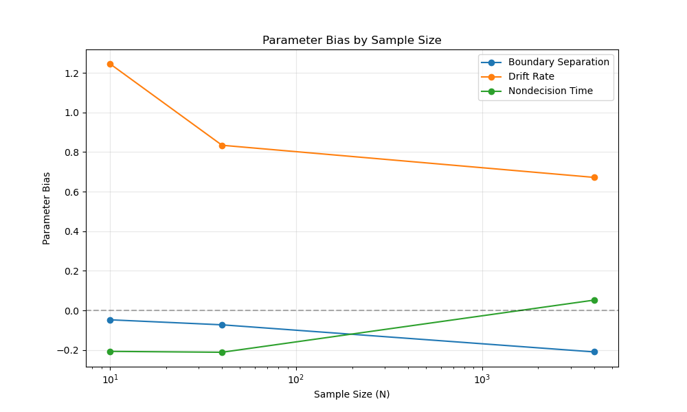
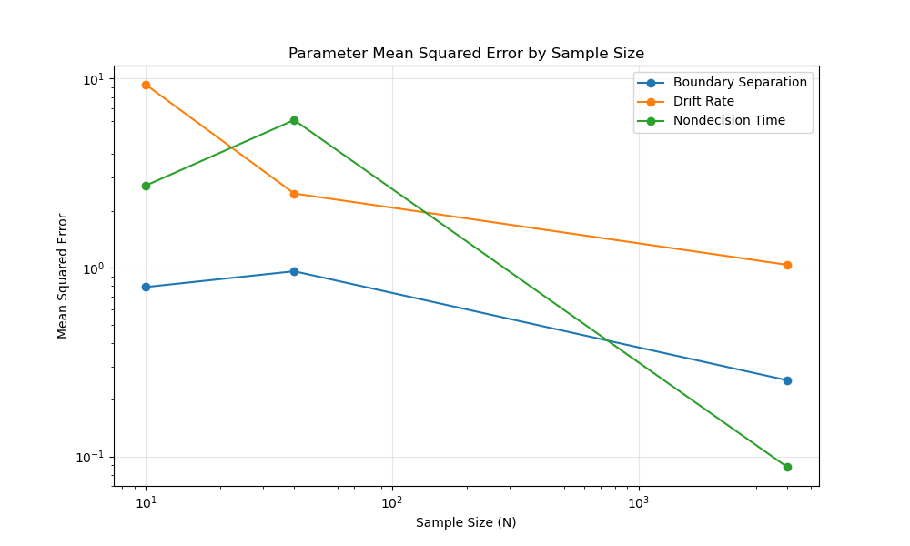
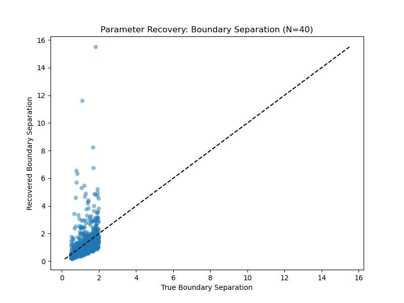
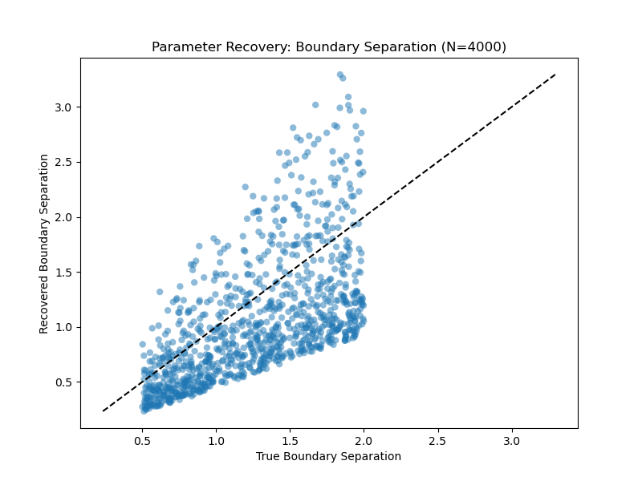

To get started:

1. Download dependencies:
```bash
pip install -r requirements.txt
```
2. Run the main script:
```bash
bash src/main.py
```
3. Run tests:
```bash
bash test/test_model.py
```

### Background
*skip this section directly to the experimental results*
<br/>
The Diffusion Model is used to transform noisy multidimensional data into an interpretable, low-dimensional representation. An example of this is in vision models that are used to classify images (ex: ResNet, DALL-E).
<br/><br/>
An "EZ" Diffusion Model is a simplified version of this that can compute estimated parameters from summary statistics (accuracy rate, mean response time, and variance of response time).
Simple mathematical equations are also substituted for the complex diffusion algorithms. Namely, the "Forward function" determines the predicted outputs of the model while the "Inverse function" reverses this and computes the parameters from the final output (summary statistics).
<br/><br/>
This is a simplified diffusion model (input data -> predict outputs -> recover parameters from outputs).


### Methods
There are three primary files in the codebase: `src/diffusion_model.py` extracts random data points and computes the summary statistics and parameters with the Diffusion Functions. The `src/simulation/py` file conducts different simulations of varying sample sizes and trials. finally, the `src/test_model.py` file creates unit tests for the functions.
<br/><br/>
First, the diffusion model selects random parameters in a given range (ex: between 0.5 and 2.0 for Boundary Separation). 
Then, the forward equation simulates the output of the data while the inverse equation computes the parameters from the summary statistics.
<br/><br/>
# Experimental results
Here are the summary statistics for the three simulations:
| n_trials | a_bias           | v_bias           | t0_bias          | a_squared_error    | v_squared_error    | t0_squared_error    |
|----------|-----------------|-----------------|-----------------|-------------------|-------------------|-------------------|
| 10       | 0.0597          | 1.0569          | -0.3685         | 1.1372            | 6.9196            | 5.0179            |
| 40       | -0.0551         | 0.8424          | -0.2040         | 0.8984            | 2.5829            | 3.1338            |
| 4000     | -0.2181         | 0.6575          | 0.0621          | 0.2358            | 1.0006            | 0.0800            |

Here, the results show improvement in parameter estimation (i.e. decrease in squared error) with increasing sample sizes (ex: error decreases from 1.1372 to 0.2358 for a_squared_error). When samples sizes are small (ex: `n_trials = 10`), the bias is large (particularly for drift `v_bias = 1.0569`, indicating that the model is slow to make a decision). Similarly, the squared error is highest here indicating a higher degree of uncertainty/noise in smaller samples.
<br/><br/>
As the sample sizes increases to `n_trials = 40`, the model is noticeably more accurate and the bias values and squared error decrease significantly. with more observations, the estimations stabilize and enable more accurate parameter recovery.


The best performance is observed at `n_trials = 4000` where the bias and squared error are at its lowest. The drift rate bias drops to **0.6576** and the `t_0` value drops to **0.0800**. The scatter plots compare the true versus recovered parameter values. For `N=4000` samples, the datapoints are more tightly clustered around the identity line while the `N=10` datapoints are more spread out. However, the model tends to systematically underestimate the `t_0` value at higher drift rates, likely due to mathematical constraints and inability to generalize to higher sample sizes.
<br/><br/>
Recovery with 40 samples for `t_0`:

Recovery with 4000 samples for `t_0`:
